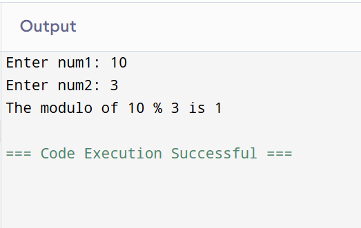

# Functions in Python: Modulo Calculator

## 🎯 Aim
To write a Python program that defines a function which accepts two values and returns their **modulo** using the `%` operator.

## 🧠 Algorithm
1. Define a function called `result` that takes two arguments `a` and `b`.
2. Inside the function, compute the modulo using `a % b`.
3. Print the result of the modulo operation.
4. Get two integer inputs from the user.
5. Call the `result` function with the user-provided values.

## 🧾 Program

```
def result(a, b):
    return a % b
num1 = int(input("Enter num1: "))
num2 = int(input("Enter num2: "))
res = result(num1, num2)
print(f"The modulo of {num1} % {num2} is {res}")
```

## Output


## Result
Thus the program has been executed successfully.