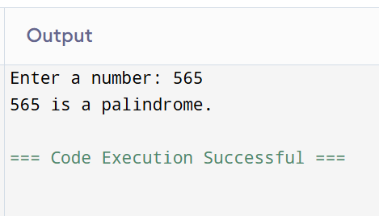

## Loops in Python: Palindrome Number Checker

## 🎯 Aim
To write a Python program that checks whether a given number is a **palindrome** using loops.

## 🧠 Algorithm
1. Get input from the user and assign it to a variable `num`.
2. Assign the value of `num` to a temporary variable `temp`.
3. Initialize a variable `rev` to 0 (used to store the reversed number).
4. Use a `while` loop to reverse the digits:
   - While `temp > 0`:
     - `rev = (10 * rev) + temp % 10`
     - `temp = temp // 10`
5. After the loop, compare `rev` with `num`:
   - If equal, print that the number is a palindrome.
   - Else, print that it is not a palindrome.

## 🧾 Program
```
def is_palindrome(number):
    original = number
    reversed_num = 0
    while number > 0:
        digit = number % 10
        reversed_num = reversed_num * 10 + digit
        number //= 10
    return original == reversed_num
num = int(input("Enter a number: "))
if is_palindrome(num):
    print(f"{num} is a palindrome.")
else:
    print(f"{num} is not a palindrome.")
```

## Output


## Result
Thus the program has been executed successfully.